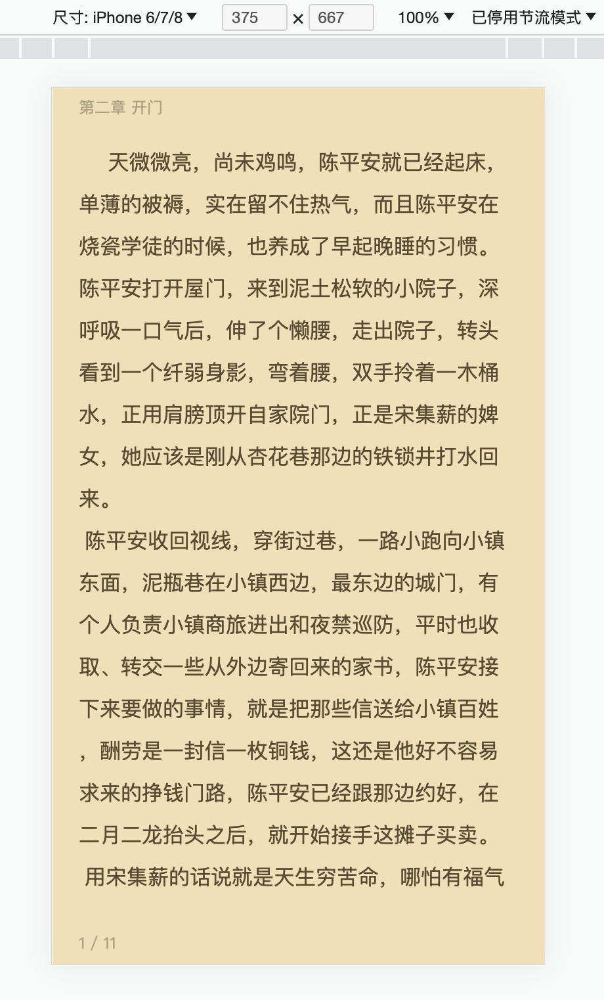
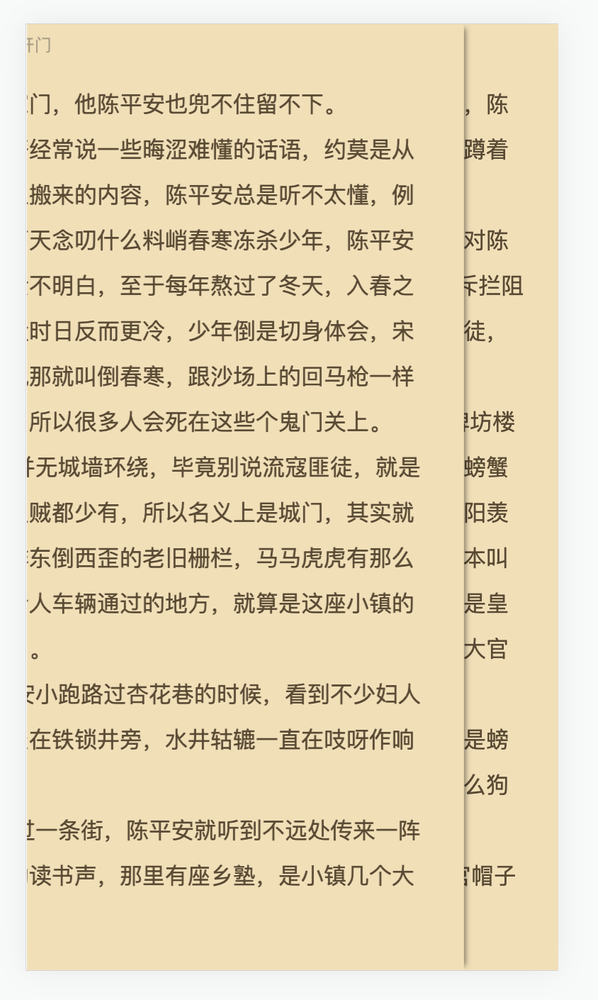

### 项目介绍

小说覆盖式翻页

### 安装

```javascript
npm install
```

### 运行

在安装依赖项之后，可以使用以下命令来启动应用程序：

```javascript
npm run dev
```

### 体验地址

[http://47.94.106.226:8080](http://47.94.106.226:8080)

### 效果图展示




### 使用代码展示

```vue
<template>
	<!-- 翻页模式为 覆盖 -->
	<cover
		ref="coverRef"
		:configProps="config"
		@onCenter="onCenter"
		@loadChapter="loadChapter"
		@preLoadChapter="preLoadChapter"
		@onPageChange="onPageChange"
		@onStartChapter="onStartChapter"
		@onEndChapter="onEndChapter"
	/>
</template>
<script setup lang="ts">
// 覆盖式翻页
import cover from './components/cover/index.vue';
import { onMounted, ref, Ref } from 'vue';
import { directoryArr } from './text.ts';

interface CoverRef {
	init: (options: {
		currentChapter: number;
		currentPage: number;
		contents: any[];
	}) => void;
	preLoadChapter: (bookInfo: any, type: string) => void;
	loadChapter: (bookInfo: any, type: string) => void;
}

const coverRef: Ref<CoverRef | null> = ref(null);
// 传入配置项 文字大小，文字颜色，背景颜色等
let config = {
	fontSize: 16,
};

// 点击屏幕中间触发
function onCenter() {
	console.log('点击了屏幕中间');
}
// 初始化 调用init传入初始信息
onMounted(() => {
	const contents = [
		{ chapter: 0, title: '第一章 惊蛰', text: getContent(0), isStart: true },
		{ chapter: 1, title: '第二章 开门', text: getContent(1) },
		{ chapter: 2, title: '第三章 日出', text: getContent(2) },
	];
	coverRef.value?.init({
		currentChapter: 1, // 进入页面显示的章节
		currentPage: 0, // 进入章节显示的页码
		contents,
	});
});
// 获取对应章节内容
function getContent(chapter: number) {
	const item = directoryArr.find((item) => item.chapter === chapter);
	return item?.text;
}

// 预加载 比如 当前读到第二章最后一页 就会提前加载第4章
function preLoadChapter(item: { chapter: number; type: string }) {
	// 判断目录有没有下下章数据
	if (!directoryArr[item.chapter]) return;
	let bookInfo = {
		chapter: item.chapter,
		title: directoryArr[item.chapter].title,
		text: getContent(item.chapter),
		isStart: directoryArr[item.chapter].isStart,
		isEnd: directoryArr[item.chapter].isEnd,
	};

	// 调用子组件预加载方法 并传入预加载数据
	coverRef.value?.preLoadChapter(bookInfo, item.type);
}

// 加载章节 比如预加载失败了 当前读到第二章最后一页 发现第三章没有数据 触发改函数
function loadChapter(item: any) {
	if (!directoryArr[item.chapter]) return;
	let bookInfo = {
		chapter: item.chapter,
		title: directoryArr[item.chapter].title,
		text: directoryArr[item.chapter].text,
		isStart: false,
		isEnd: directoryArr[item.chapter].isEnd,
	};

	// 调用子组件方法 加载章节内容
	coverRef.value?.loadChapter(bookInfo, item.type);
}
// 第一章第一页 点击上一页时触发
function onStartChapter() {
	console.log('前面没有章节了');
}
// 最后一章 最后一页 点击下一页时触发
function onEndChapter() {
	console.log('已经读完全部内容了');
}
// 当前正在阅读的信息
function onPageChange(readInfo: any) {
	console.log(readInfo);
}
</script>

<style scoped>
.button-pre {
	position: fixed;
	bottom: 10px;
	left: 100px;
	z-index: 999;
}
.button {
	position: fixed;
	bottom: 10px;
	left: 150px;
	z-index: 999;
}
</style>
```
